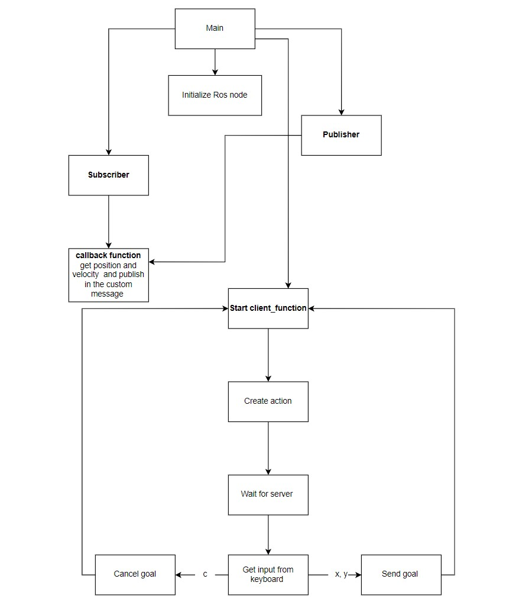

# Research Track: Assignment #2
## Python Robotics Simulator 
### Professor [Carmine Recchiuto](https://github.com/CarmineD8)
### Student: [Raffaele Pumpo](https://github.com/RaffaelePumpo)

## Description 
In this assignment, I developed, by using **ROS**, three nodes and the launch file. The aim of the assignment is to allow to set value of the goal position that the robot has to reach, to stop the robot and to print the distance of the robot from the goal position and its average speed. The robot travels in a 3D simulation environment called *Gazebo*. Here is the arena:

If the robot  is too close to an obstacle, it turns in a such a way that will have a wall on its right side, and then it continues its tasks.
## Running the code 

- First of all, you have to install **xterm**:

       sudo apt install xterm

- after that, download my package  `assignment_2_2022 `inside the `src` folder of your ROS workspace

- Go to your ROS workspace run the command:

      catkin_make

- Finally, run the code, type the following command:

      roslaunch assignment_2_2022 assignment1.launch

## Nodes
There are six nodes in the package:

- `bug_as.py` is the action server node that calls the  services to move the robot to the goal position
- `go_to_point_service.py` is the service node to move the robot to the goal position
- `wall_follow_service.py` is the service node to avoid obstacles

and the other three nodes are the ones that I developed:

- `Client.py` is the action client node, allowing the user to set a target, x and y, or to cancel it. The node also publishes the robot position and velocity as a custom message.
The behaviour of the node is explained in the following flowchart:

- `Server.py` is the service node that, when called, prints the number of goals reached and cancelled 
-  `Node_c.py` is the node that subscribes to the robot’s position and velocity taking the values from the custom message and prints the distance of the robot from the target and the robot’s average speed. Using a parameter to set how fast the node publishes the information.

After the program has started, you can interact with four windows:

- **Rviz** is a ROS visualization 
- **Gazebo** is the 3D simulator environment with the obstacles and the robot 
- **Client.py** is the window where the user can set the goal position or cancel it from keyboard
- **Node_c.py** is the window where distance from target and average speed of the robot are showed

- To know the number of goals reached and canceled, type on another tab:

      rosservice call /goals

- You can set the frequency from the launch file assignment1.launch inside of the launch folder, by changing the value and relaunch the program. .

### Possible implementations
-It would be easier to see the desired position with a marker on the arena for the goal.

-The robot if it is too close to an obstacle, it turns in a such a way that will have a wall on its right side, and then it continues its tasks. It would be nice to make it turns in a different way, for example, to the left side if it is the shorter way.
